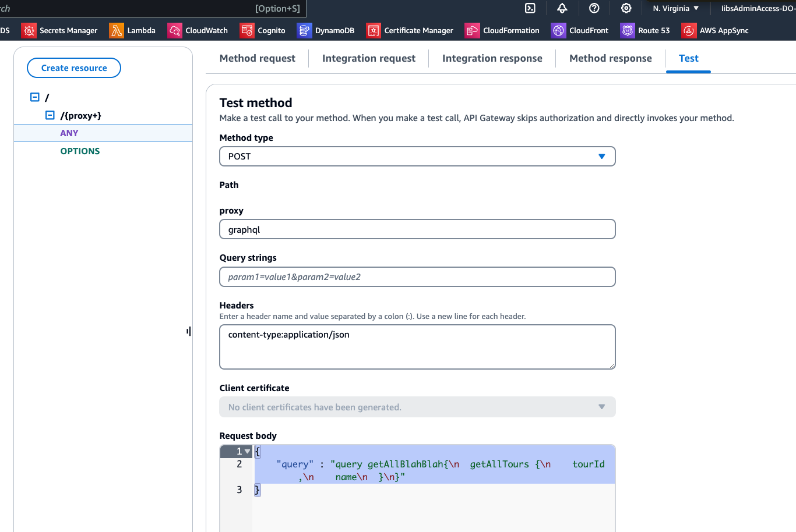
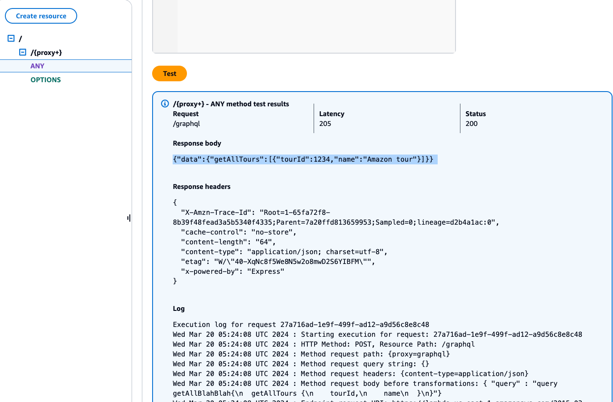
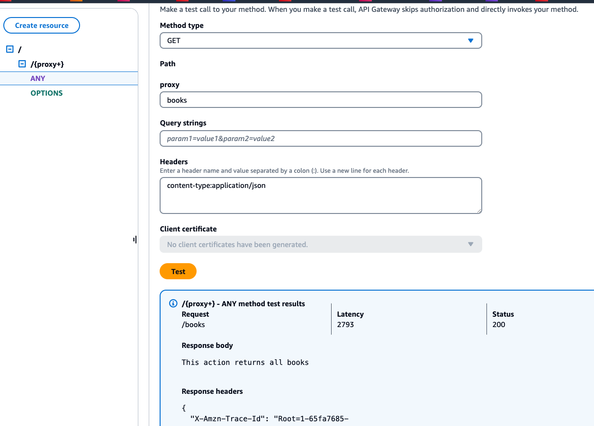
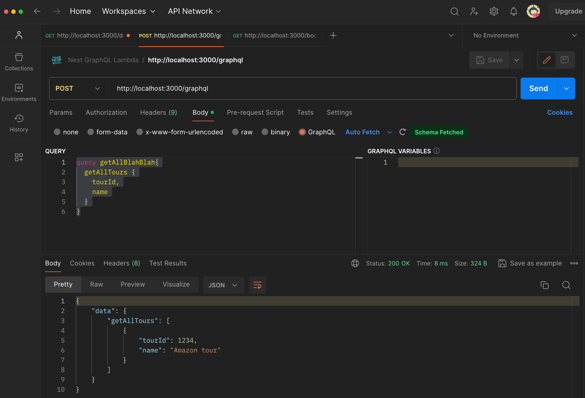

# NestJS GraphQL Boilerplate codes
* Ready to use template with NestJS v10 and Node@20
* REST API and GraphQL API on the same baseURL
* Deployment with AWS Serverless on Api Gateway and Lambda
* Deployment with Google Cloud Function (TODO)


## Description
* On local, REST API root at `localhost:3000/books` and GraphQL at: `localhost:3000/graphql`
* On AWS, API Gateway will need to be configured to point to <LambdaURL> or <LambdaURL/graphql>

## MongoDB Mongoose TypeORM
* MongoDB: Abstract Repository, AbtractEntity, and ready-to-use database module
* Add a local Mongod server or Create an Atlas cloud server and Enable all commented-out `DatabaseModule` and `ToursRepository`
* Nest will fail to init, if there is no proper MONGODB_URI, or mongoose cannot connect to datagbase

## Installation

```bash
$ npm install
```

## Creating nest resource
* Tours REST endpoint will be deployed on root <LambdaURL> or <localhost:3000>
`nest g resource tours`
* Books GraphQL endpoint will be deployed on <LambdaURL/graphql> or <localhost:3000/graphql>
`nest g rosource books`

## Running the app

```bash
# development
$ npm run start

# watch mode
$ npm run start:dev

# production mode
$ npm run start:prod

# build
$ npm run build
```

## Build
* Option 1: use the *.zip file inside `.serverless` folder
* Option 2: use `/build` folder, in which, we can deploy the production `node_modules` into a Lambda Layer
* Option 3: use `vite` and `esbuild` to bundling into 1 single javascript file. (TODO)

## AWS Deployment
* Option 1: `npm run deploy:sls`, make sure that `pino` logger and `autoSchemaFile` are not run in Production
  Lambda does not allow write permission on run-time code, except for /tmp folder.
* Option 2: Using CDK deployment (TODO)
* Make sure to [enable CORS on Api Gateway](https://docs.datomic.com/cloud/tech-notes/cors-lambda-proxy.html)

## Test

```bash
# unit tests
$ npm run test

# e2e tests
$ npm run test:e2e

# test coverage
$ npm run test:cov
```

## API Gateway with both REST and GraphQL available at the same time
* When the Schema is simple, both REST and GraphQL has average execution time of 20-30 ms
* Lambda cold-start is about 2500ms
* 
* 
* 
* 


## References
* [Scalfolding Nest](https://docs.nestjs.com/)
`npm i -g @nestjs/cli` and `nest new project-name`
* [Quickstart with NestJS GraphQL](https://docs.nestjs.com/graphql/quick-start):
`npm i @nestjs/graphql @nestjs/apollo @apollo/server graphql`
* Install [Nest ConfigService](https://docs.nestjs.com/techniques/configuration#using-the-configservice) to be used parsing env files:
`npm i @nestjs/config`
* Using [Joi](https://joi.dev) and Class Validator for configs and DTO. Alternatives are [validator](https://www.npmjs.com/package/validator)
* Logger with [Pino](https://www.npmjs.com/package/nestjs-pino?activeTab=readme):
`npm i pino-http pino-pretty nestjs-pino`
* [Serverless Instructions with Nest](https://docs.nestjs.com/faq/serverless):
```
npm i @codegenie/serverless-express aws-lambda
npm i -D @types/aws-lambda serverless-offline
```
* [Official Serverless Instructions](https://www.serverless.com/framework/docs/tutorial)
* Deploy [NestJS on different cloud platforms](https://github.com/nestjs/docs.nestjs.com/issues/96)
* [Mongo DB Abstraction](https://docs.nestjs.com/techniques/mongodb) layer with `@nestjs/mongoose` and `mongoose`
* [Mongo DB migrate-mongo](https://medium.com/@ashansube/managing-mongodb-database-migrations-in-node-js-with-migrate-mongo-9a510dbfd868):
`npm i migrate-mongo && npm i -D @types/migrate-mongo`
* Using `serverless package` with `excludes` to zip the final build. [Serverless Package](https://www.serverless.com/framework/docs/providers/aws/cli-reference/package)